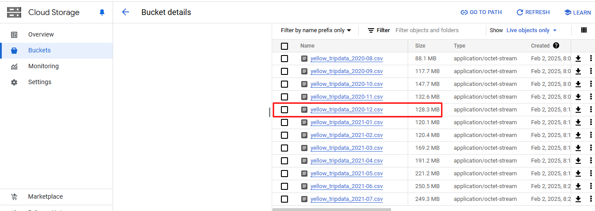

## Questions:

### 1. Within the execution for Yellow Taxi data for the year 2020 and month 12: what is the uncompressed file size (i.e. the output file yellow_tripdata_2020-12.csv of the extract task)?



As can be seen in the print above, the correct answer is **128.3 MB**.

### 2. What is the rendered value of the variable file when the inputs taxi is set to green, year is set to 2020, and month is set to 04 during execution?

This is what the `variables` section in Kestra flows:

```
variables:
  file: "{{inputs.taxi}}_tripdata_{{inputs.year}}-{{inputs.month}}.csv"
  gcs_file: "gs://{{kv('GCP_BUCKET_NAME')}}/{{vars.file}}"
  table: "{{kv('GCP_DATASET')}}.{{inputs.taxi}}_tripdata_{{inputs.year}}_{{inputs.month}}"
  data: "{{outputs.extract.outputFiles[inputs.taxi ~ '_tripdata_' ~ inputs.year ~ '-' ~ inputs.month ~ '.csv']}}"
```

If `taxi='green'`, `year=2020`, and `month=04`, then `{{render(vars.file)}}` will render `green_tripdata_2020-04.csv`.

### 3. How many rows are there for the Yellow Taxi data for all CSV files in the year 2020?

This question can be answered using the following query, which outputs **24,648,499**.

```
SELECT
  COUNT(1) AS n_rows
FROM
  `zoomcamp_kestra.yellow_tripdata`
WHERE
  filename LIKE '%2020%'
```

### 4. How many rows are there for the Green Taxi data for all CSV files in the year 2020?

This question can be answered using the following query, which outputs **1,734,051**.

```
SELECT
  COUNT(1) AS n_rows
FROM
  `zoomcamp_kestra.green_tripdata`
WHERE
  filename LIKE '%2020%'
```

### 5. How many rows are there for the Yellow Taxi data for the March 2021 CSV file?

This question can be answered using the following query, which outputs **1,925,152**.

```
SELECT
  COUNT(1) AS n_rows
FROM
  `zoomcamp_kestra.yellow_tripdata`
WHERE
  filename = 'yellow_tripdata_2021-03.csv'
```

### 6. How would you configure the timezone to New York in a Schedule trigger?

According to Kestras documentation ([link 1](https://kestra.io/docs/workflow-components/triggers/schedule-trigger#:~:text=A%20schedule%20that%20runs%20daily,timezone%3A%20America/New_York), [link 2](<https://kestra.io/plugins/core/triggers/io.kestra.plugin.core.trigger.schedule#timezone:~:text=k.a.%20disabled).-,timezone,the%20cron%20expression.%20Default%20value%20is%20the%20server%20default%20zone%20ID.,-Outputs>)), the configuration can be done adding the `timezone: America/New_York` to `triggers`, as shown in the example extracted from link 1:

```
triggers:
  - id: daily
    type: io.kestra.plugin.core.trigger.Schedule
    cron: "@daily"
    timezone: America/New_York
```

So the correct answer is **Add a timezone property set to America/New_York in the Schedule trigger configuration**.
