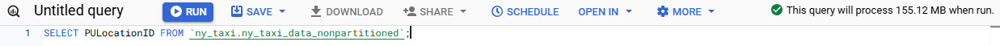
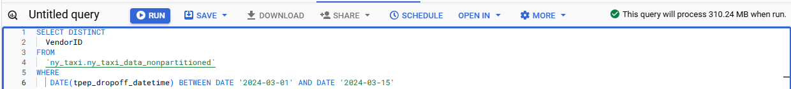
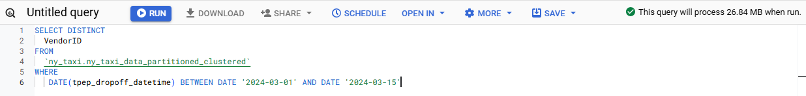

## Questions:

### 1: What is count of records for the 2024 Yellow Taxi Data?

To answer this question, first we need to create the table with the 2024 Yellow Taxi Data:

```SQL
CREATE OR REPLACE EXTERNAL TABLE `ny_taxi.ny_taxi_data_external`
OPTIONS (
  format = 'PARQUET',
  uris = ['gs://ny_taxi_data_de_zoomcamp/yellow_tripdata_2024-*.parquet']
);
```

With the table created, we can use the following query to get the number of records in it, **20,332,093**.

```SQL
SELECT COUNT(1) AS n_records FROM `ny_taxi.ny_taxi_data_external`
```

### 2: Write a query to count the distinct number of PULocationIDs for the entire dataset on both the tables. What is the estimated amount of data that will be read when this query is executed on the External Table and the Table?

To answer this question, we need to create a materialized table in BigQuery. I'll do this using the following query:

```SQL
CREATE OR REPLACE TABLE `ny_taxi.ny_taxi_data_nonpartitioned` AS
  SELECT * FROM `ny_taxi.ny_taxi_data_external`;
```

Then, using the queries in the images below we can get the answer to Question 2:
**0B for the external table and **


### 3: Write a query to retrieve the PULocationID from the table (not the external table) in BigQuery. Now write a query to retrieve the PULocationID and DOLocationID on the same table. Why are the estimated number of Bytes different?

As can be seen in the images below, the estimated number of bytes is different. This is because BigQuery is a columnar database ([GCP documentation](https://cloud.google.com/bigquery/docs/storage_overview#:~:text=BigQuery%20stores%20table%20data%20in%20columnar%20format%2C%20meaning%20it%20stores%20each%20column%20separately.%20Column%2Doriented%20databases%20are%20particularly%20efficient%20at%20scanning%20individual%20columns%20over%20an%20entire%20dataset.)), so querying two columns requires reading more data than querying just one, leading to a higher estimated number of bytes processed.




### 4: How many records have a fare_amount of 0?

To answer this question, you need to count how many records there are in the table with `fare_amount = 0`. This can be done using the following query, which results in **8333**

```SQL
SELECT
  COUNT(1) AS n_records
FROM
  `ny_taxi.ny_taxi_data_nonpartitioned`
WHERE
  fare_amount = 0;
```

### 5: What is the best strategy to make an optimized table in Big Query if your query will always filter based on tpep_dropoff_datetime and order the results by VendorID?

Assuming the query will filter the `DATE(tpep_dropoff_datetime)`, not the timestamp itself (It would not be possible to partition by the timestamp, because this would exceed the limit of 4000 thousand partitions in BigQuery), the best strategy to optimize the amount of data processed to run the query is to **partition by DATE(tpep_dropoff_datetime) and cluster on VendorID**, because:

- BigQuery allows only one partition by table, and the partition column must be a time-unit column, the ingestion time or an integer range column. `tpep_dropoff_datetime` is a time-unit column, while `VendorID`, even though it is an integer column, it is more of a categorical column, and could also be of type STRING.
- Partitioning by `tpep_dropoff_datetime` is a good idea to distribute data evenly across different days, since the amount of records in each day does not vary much. On the other hand, the data is distributed very unevenly regarding `VendorID`.
- Clustering on `VendorID` can improve the performance of the query, since it will always order the results by `VendorID`. Clustering sorts the table based on user-defined columns, which increases the performance when ordering the results by the clustering columns ([BigQuery documentation](https://cloud.google.com/blog/products/data-analytics/new-bigquery-partitioning-and-clustering-recommendations#:~:text=Partitioning%20divides%20a%20table%20into%20segments%2C%20while%20clustering%20sorts%20the%20table%20based%20on%20user%2Ddefined%20columns.%20Both%20methods%20can%20improve%20the%20performance%20of%20certain%20types%20of%20queries%2C%20such%20as%20queries%20that%20use%20filter%20clauses%20and%20queries%20that%20aggregate%20data.)).

### 6. Write a query to retrieve the distinct VendorIDs between tpep_dropoff_datetime 2024-03-01 and 2024-03-15 (inclusive). Use the materialized table you created earlier in your from clause and note the estimated bytes. Now change the table in the from clause to the partitioned table you created for question 5 and note the estimated bytes processed. What are these values?

Using the following queries, we discover that the estimated bytes processed is **310.24 MB for the non-partitioned table and 26.84 MB for the partitioned table**.

```SQL
-- Non-partitioned table
SELECT DISTINCT
  VendorID
FROM
  `ny_taxi.ny_taxi_data_nonpartitioned`
WHERE
   DATE(tpep_dropoff_datetime) BETWEEN DATE '2024-03-01' AND DATE '2024-03-15'

-- Partitioned and clustered table
SELECT DISTINCT
  VendorID
FROM
  `ny_taxi.ny_taxi_data_partitioned_clustered`
WHERE
   DATE(tpep_dropoff_datetime) BETWEEN DATE '2024-03-01' AND DATE '2024-03-15'
```




### 7: Where is the data for external tables stored?

The data is stored in **Google Cloud Storage**, as can be seen in the statement that creates the external table (`gs` stands for Google Storage)

```SQL
CREATE OR REPLACE EXTERNAL TABLE `ny_taxi.ny_taxi_data_external`
OPTIONS (
  format = 'PARQUET',
  uris = ['gs://ny_taxi_data_de_zoomcamp/yellow_tripdata_2024-*.parquet']
);
```

### 8: It is best practice in Big Query to always cluster your data?

No. For small tables (<1GB), clustering doesn't show significant performance improvement. Also, clustering can increase storage costs due to additional metadata and reorganization overhead.